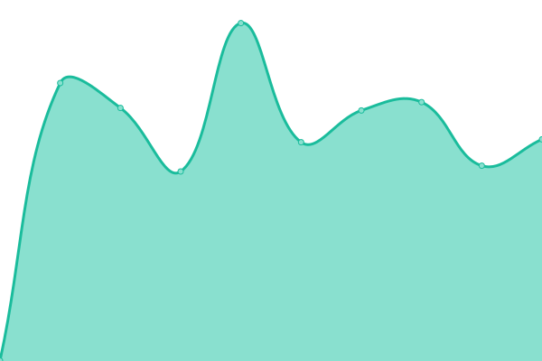

# [📈 Live Status](https://upptime.github.io/upptime): <!--live status--> **🟩 All systems operational**

This repository contains the open-source uptime monitor and status page for [Upptime](https://upptime.js.org), powered by [Upptime](https://github.com/upptime/upptime).

<!--start: status pages-->
<!-- This summary is generated by Upptime (https://github.com/upptime/upptime) -->
<!-- Do not edit this manually, your changes will be overwritten -->
<!-- prettier-ignore -->
| URL | Status | History | Response Time | Uptime |
| --- | ------ | ------- | ------------- | ------ |
|  [Kactus](https://www.kactus.com) | 🟩 Up | [kactus.yml](https://github.com/GregHubs/uptime/commits/HEAD/history/kactus.yml) | 

 739ms
     
 | 

<a href="https://GregHubs.github.io/uptime/history/kactus">100.00%</a>
    

|  [Bird Office](https://www.bird-office.com) | 🟩 Up | [bird-office.yml](https://github.com/GregHubs/uptime/commits/HEAD/history/bird-office.yml) | 

 679ms
     
 | 

<a href="https://GregHubs.github.io/uptime/history/bird-office">100.00%</a>
    

<!--end: status pages-->

[**Visit our status website →**](https://greghubs.github.io/uptime/)

## 📄 License

- Powered by: [Upptime](https://github.com/upptime/upptime)
- Code: [MIT](./LICENSE) © [Upptime](https://upptime.js.org)
- Data in the `./history` directory: [Open Database License](https://opendatacommons.org/licenses/odbl/1-0/)
